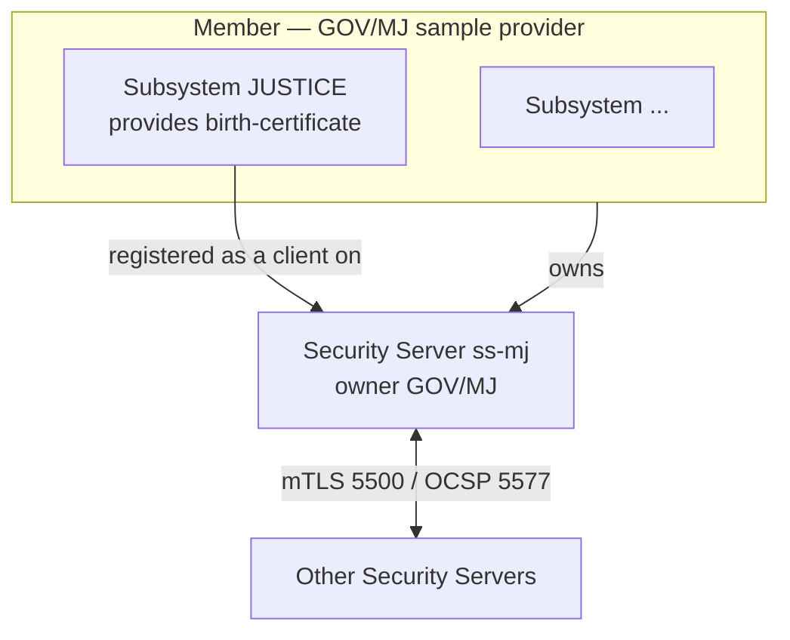
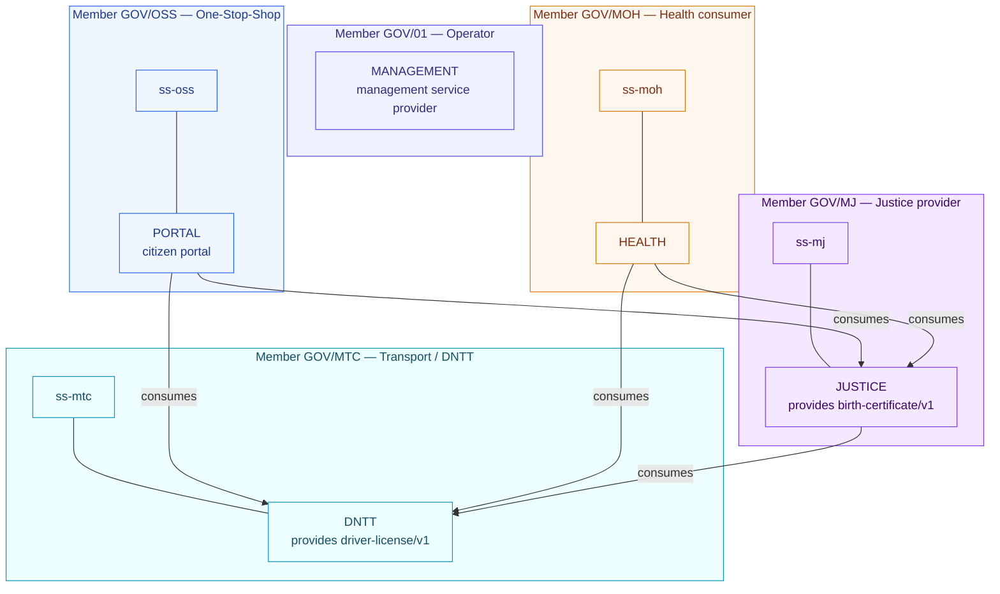

# Core concepts: Member vs Subsystem vs Security Server

These three are different things. Mixing them up is the most common X-Road onboarding mistake.

| Concept | What it is | Identifier | Where in the Central Server |
|---|---|---|---|
| **Member** | An organization that joins X-Road (agency, company, operator) | `INSTANCE/CLASS/CODE` e.g. `TL-TEST/GOV/MJ` | Members / Clients |
| **Subsystem** | A logical group of services **inside** a member. It consumes/provides services and holds ACLs. | `…/CLASS/CODE/SUBSYSTEM` e.g. `TL-TEST/GOV/MJ/JUSTICE` | Member → Subsystems tab |
| **Security Server** | The gateway machine that hosts clients and routes signed messages over mTLS. Has an owner member + a server code. | `INSTANCE/CLASS/CODE/SERVER_CODE` e.g. `TL-TEST/GOV/MJ/ss-mj` | Security Servers menu |

**Security Servers are NOT subsystems.** You never add a Security Server on the Subsystems tab.

## How they relate

- A **member** owns one or more **Security Servers**.
- A **member** has zero or more **subsystems**.
- A **subsystem** becomes usable only when it is **registered as a client on a Security Server** (a management
  request approved by the Central Server). Until then it shows **UNREGISTERED**.

## Registration flow (per organization)

1. **Register the member** in the Central Server (Members → Add member; needs a member class first).
2. **Register the Security Server**: run its setup wizard (owner member + server code), generate the
   **authentication key** (CSR), sign it at the CA, import it, register the auth cert. The Central Server
   operator approves it under **Management Requests**. It then appears under **Security Servers**.
3. **Add and register the subsystems**: add the subsystem to the member, then on the Security Server **Add
   client** for that subsystem and send the registration request; the Central Server approves it.

## Statuses you will see

| Status | Meaning |
|---|---|
| `SAVED` | Saved locally on the Security Server, not yet sent for registration |
| `REGISTRATION IN PROGRESS` | Request sent, waiting for Central Server approval |
| `UNREGISTERED` | Exists logically (e.g. a subsystem) but not registered on any Security Server |
| `REGISTERED` | Active in the global configuration; usable |

## In this sandbox

- Members: `GOV/MJ`, `GOV/MOH`, `GOV/MTC`, `GOV/OSS` (plus `GOV/01` for the management service).
- Security Servers: `ss-mj`, `ss-moh`, `ss-mtc`, `ss-oss` (each owned by its member).
- Subsystems: `JUSTICE`, `HEALTH`, `DNTT`, `PORTAL`, `MANAGEMENT`.

### Full sandbox map (members, Security Servers, subsystems, who consumes what)

- Each **member** owns one **Security Server** and exposes its services through a **subsystem**.
- Access (consume arrows) follows the ACLs in `xroad/config/topology.yml`: `driver-license` is granted to
  `PORTAL`, `JUSTICE`, `HEALTH`; `birth-certificate` is granted to `PORTAL`, `HEALTH`.

See `sandboxes/timor-leste/xroad/config/topology.yml` for the full map and the example README Step 2b for the
UI walkthrough. Official reference: <https://docs.x-road.global/>.
