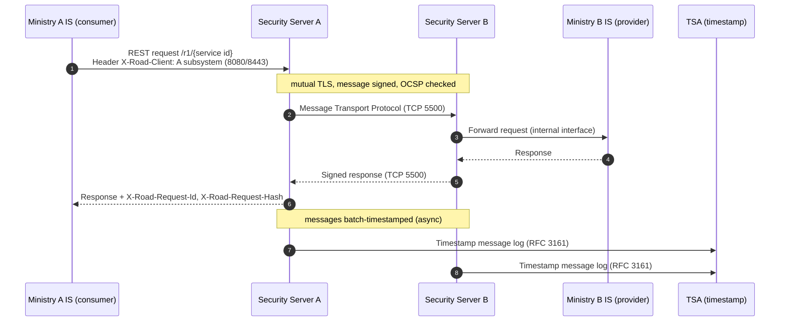
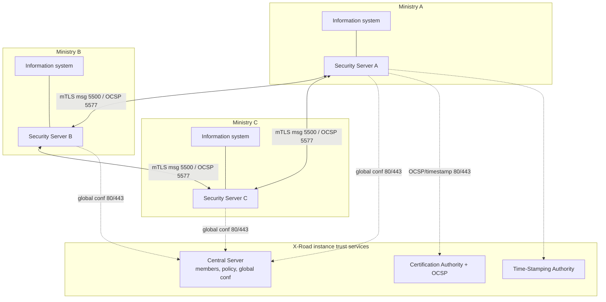
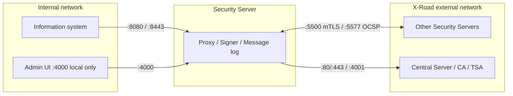

# Integration Diagrams, Protocols & Ports

Diagrams are code. Keep Mermaid sources in the repo (e.g. `docs/diagrams/*.md`), review them in pull
requests, and render them on GitHub. Update the diagram in the same PR that changes the topology or the
`xrdsst` configuration so the picture never drifts from reality.

## Protocols X-Road uses (and which to choose)

| Concern | Protocol | Use when |
|---|---|---|
| Service messaging (preferred) | X-Road **REST** Message Protocol (over OpenAPI 3) | New services. REST-first per the tech radar. |
| Service messaging (legacy) | X-Road **SOAP** Message Protocol (WSDL) | Interop with existing SOAP services only. |
| Server-to-server transport | **Message Transport Protocol** over mutual TLS | Always; handled by the Security Servers, not your code. |
| Certificate validity | **OCSP** | Always; carried inside the transport protocol. |
| Proof of existence | **RFC 3161 timestamping** (TSA), batch | Always; asynchronous, for non-repudiation. |
| Trust distribution | **Configuration distribution protocol** (signed global conf) | Always; from Central Server (optionally via Configuration Proxy). |
| Monitoring | Operational + environmental monitoring | For observability and SLAs. |

## Ports (official Security Server defaults; verify per release)

| Port | Dir | Party | Purpose |
|---|---|---|---|
| TCP 5500 | in/out (external) | other Security Servers | Message exchange (mTLS) |
| TCP 5577 | in/out (external) | other Security Servers | OCSP response queries |
| TCP 80 | in (external) | ACME servers | ACME challenge |
| TCP 4001 | out (external) | Central Server | Server communication |
| TCP 80, 443 | out (external) | Central Server / CA / OCSP / TSA | Global conf download, OCSP, timestamping |
| TCP 587 | out (external) | mail server | Notifications |
| TCP 4000 | in (internal) | operators | Admin UI + management REST API (local only) |
| TCP 8080, 8443 | in (internal) | consumer information systems | Information system access points |
| TCP 80/443/other | out (internal) | provider information systems | Producer endpoints |
| TCP 2080 | out (internal) | op. monitoring daemon | Operational data exchange |
| 5432 / 2080 / 2552 / 5559 / 5560 / 5566 / 5567 / 5675 (TCP), 514 (UDP) | loopback | local components | DB, monitoring, signer, proxy, conf client, audit log |

Trust-zone rule: only **5500** and **5577** face the external network; information systems live behind
**8080/8443** on the internal network; the admin UI (**4000**) is local only. Diagrams must keep these zones distinct.

## Template 1 — Inter-ministry call (sequence diagram)

Consumer at Ministry A calls a service at Ministry B. Copy and rename the participants.

## Template 2 — Federation topology across ministries (deployment graph)

Each ministry runs its own Security Server; all trust the same Central Server and trust services.

## Template 3 — Trust zones (where the ports live)

## Best practices for these diagrams

- One sequence diagram per integration scenario; one federation graph per environment (dev/test/prod).
- Label every cross-server edge with the protocol and port. Ambiguous arrows hide trust-boundary mistakes.
- Use real subsystem identifiers (`INSTANCE/CLASS/CODE/SUBSYSTEM`) in participant names so the diagram matches headers and ACLs.
- Keep diagrams in version control next to the `xrdsst` config and update both in the same change.
- Do not put secrets, real certificates, or PII in diagrams.

## References

- Security Server installation guide (ports): https://github.com/nordic-institute/X-Road/blob/develop/doc/Manuals/ig-ss_x-road_v6_security_server_installation_guide.md
- Protocols: https://docs.x-road.global (Protocols section)
- Mermaid syntax: https://mermaid.js.org
