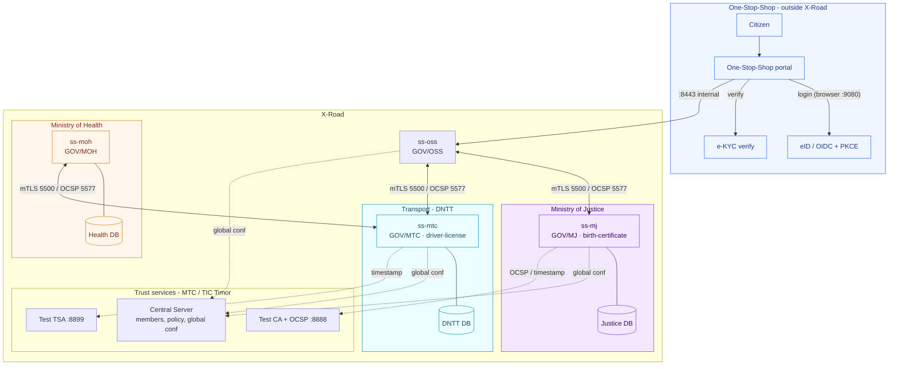
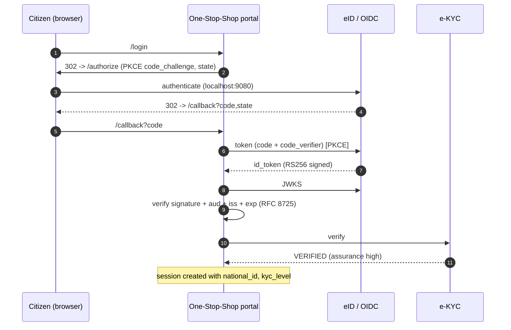
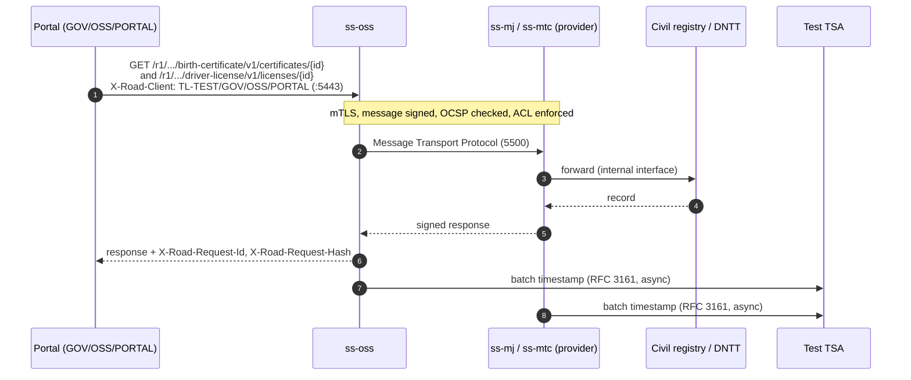
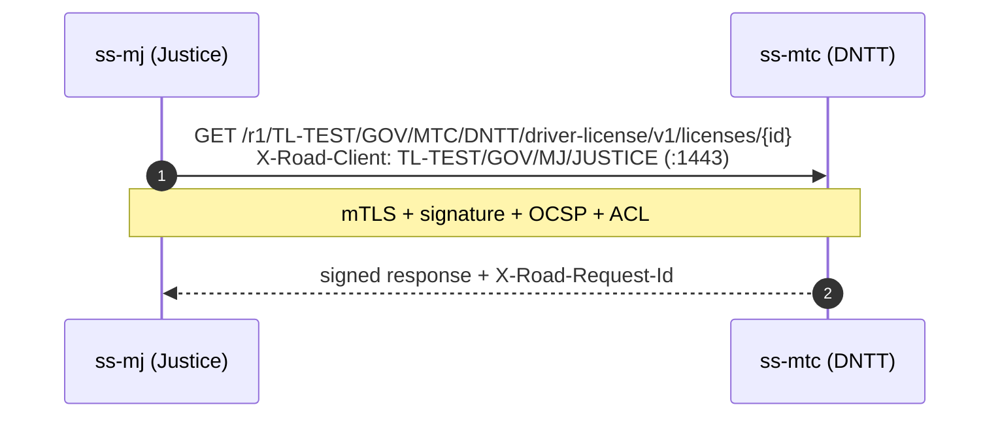

# Timor-Leste topology & service flows

Two layers, kept separate: the **One-Stop-Shop + identity** layer (citizen login, outside X-Road) and the
**X-Road** layer (secure system-to-system exchange).

## Topology

## Citizen login (OIDC authorization_code + PKCE + JWKS)

Identity is handled in the One-Stop-Shop layer, before any X-Road call.

## Citizen service request via One-Stop-Shop (birth-certificate AND driver-license)

The portal asserts the citizen and calls each service through **its own Security Server (ss-oss)**.

## Inter-ministry (system-to-system, no portal)

