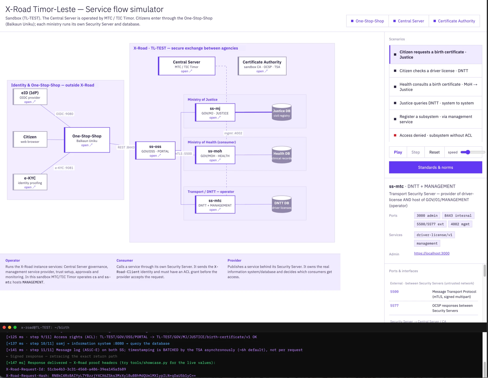

# Timor-Leste X-Road Sandbox

This sandbox simulates ministries joined to a single X-Road instance, exchanging data via APIs under a single PKI trust fabric. The **One-Stop-Shop portal** serves as the citizen entry point (e-KYC / eID).

| Ministry / portal | Member | Subsystem | Role |
|---|---|---|---|
| Ministry of Justice | `TL-TEST/GOV/MJ` | `JUSTICE` | provider of `birth-certificate`, consumer |
| Ministry of Health | `TL-TEST/GOV/MOH` | `HEALTH` | consumer |
| Transportes e Comunicacoes (DNTT) | `TL-TEST/GOV/MTC` | `DNTT` | provider of `driver-license` |
| One-Stop-Shop (one-stop-shop) | `TL-TEST/GOV/OSS` | `PORTAL` | consumer on behalf of citizens |

> **Test/dev only.** Every image, credential, PIN, and the Test CA here is for the sandbox and must never be used in production or against real citizen data.

---

## Journey 1: For Administrators (Network Operators)

Administrators (e.g., TIC Timor) are responsible for bringing up the infrastructure, configuring the Central Server, and setting up the Security Servers for the agencies.

### Automated One-Command Setup

The entire ecosystem (starting containers, configuring the Central Server, adding Trust Services, downloading anchors, provisioning Security Servers, approving registrations, publishing services, and testing real traffic) is automated. You only need one command:

```bash
cd sandboxes/timor-leste
./init.sh
```

This follows the official X-Road `xrd-dev-stack` shape: bootstrap the Central Server and trust first, initialize Security Servers, create CSRs, sign/import/register certificates, approve management requests, publish clients/services/ACLs, then activate every certificate once OCSP and the approvals have settled. It uses supported REST APIs, `xrdsst`, and Hurl. It does not write directly to X-Road databases.

Important: do not use a full `xrdsst -c xroad/config/xrdsst-config.yaml apply` as the main bootstrap path in this sandbox. It can try client/subsystem certificate work before the Security Servers and management services have reached the required global-configuration state. `init.sh` runs the safer staged sequence instead.

The API verification is Hurl-based, matching the upstream `xrd-dev-stack` approach: `tools/e2e.hurl` is the canonical E2E test and `tools/e2e-test.sh` runs it in the Hurl container with `--file-root`, `--retry`, and `--retry-interval`.

UIs Available:
- **Central Server:** `https://localhost:4000` (login `xrd` / `secret`)
- **Test CA:** `http://localhost:8888/testca/`
- **One-Stop-Shop portal:** `http://localhost:8000` · **eID:** `:9080` · **e-KYC:** `:9081`
- Security Servers admin panels (login `xrd` / `secret`):
  - ss-mj (Justice): `https://localhost:1000`
  - ss-moh (Health): `https://localhost:2000`
  - ss-mtc (DNTT): `https://localhost:3000`
  - ss-oss (Portal): `https://localhost:5000`

---

## Journey 2: For Implementers (Developers & Agencies)

Implementers are the developers building APIs (e.g., Ministry of Justice) or consuming APIs (e.g., One-Stop-Shop). They work with the X-Road ecosystem once it has been provisioned by the Administrator.

### 1. Publishing Services & Zero-Trust (ACLs)
X-Road authenticates **systems**, not end users. A ministry is onboarded once and then reaches any service it is granted.

`xroad/config/xrdsst-config.yaml` shows how DNTT publishes `driver-license` and the Ministry of Justice publishes
`birth-certificate`, each granted to the One-Stop-Shop portal (and selected ministries). OpenAPI 3.1 contracts
for both services are in `xroad/api/`. If you change who can access what, re-run the management/service phase:
```bash
tools/scripts/provision-mgmt.sh
```

### 2. Consuming Services (Inter-Ministry and via the portal)
You route the request through **your own** Security Server. Both `birth-certificate` and `driver-license` are
consumed by the One-Stop-Shop (subsystem `OSS/PORTAL`, through `ss-oss` on port 5443):

```bash
# Driver license via One-Stop-Shop
curl -k -H "X-Road-Client: TL-TEST/GOV/OSS/PORTAL" \
  "https://localhost:5443/r1/TL-TEST/GOV/MTC/DNTT/driver-license/v1/licenses/TL-12345"

# Birth certificate via One-Stop-Shop
curl -k -H "X-Road-Client: TL-TEST/GOV/OSS/PORTAL" \
  "https://localhost:5443/r1/TL-TEST/GOV/MJ/JUSTICE/birth-certificate/v1/certificates/TL-67890"
```
System-to-system also works, e.g. Justice querying DNTT through its own Security Server (port 1443).
URL format: `<your_security_server>/r1/<provider_subsystem>/<service_code>`.

### 3. Citizen Entry Point (One-Stop-Shop Portal)
The One-Stop-Shop is a consumer information system. It authenticates the citizen with the eID via **OpenID
Connect authorization_code + PKCE**, **verifies the ID-token signature against the IdP JWKS** (RFC 8725), runs
**e-KYC identity verification**, then calls services on the citizen's behalf through its own Security Server
(`ss-oss`).

- Open **`http://localhost:8000`** -> **Sign in with eID** -> log in at the eID mock -> back to the portal.
- The portal runs e-KYC (shows the verified assurance level), then lets the citizen **choose a service**
  (birth-certificate or driver-license). The result renders the X-Road request and the
  `X-Road-Request-Id` / `X-Road-Request-Hash` headers.

### 4. Interactive Flow Simulator
Open `citizen/simulator/simulator.html`. It maps the ecosystem with the **One-Stop-Shop/identity** zone visually separated
from the **X-Road** zone. **Click any server node to open its admin UI.** Click a scenario to animate the
message flow and the zero-trust steps (eID login, ACL check, mTLS, OCSP, signing, timestamping). Mermaid
diagrams of the same flows are in `docs/diagram.md`.



---

## Troubleshooting

Read the real reason instead of guessing: `python3 tools/sandboxctl.py logs` (or
`docker compose exec -T cs sh -lc 'cat /var/log/xroad/.global_conf_gen_status'`).

| Symptom | Real cause | Fix |
|---|---|---|
| `Global configuration generation failing` | One of the required CS pieces is missing | Check `.global_conf_gen_status`, then the rows below |
| `Signing of external configuration failed - active key missing` | No **active** signing key on a source | Add key **and Activate** on Internal **and** External (Step 2.3) |
| `element 'managementService' is not complete ... managementRequestServiceProviderId` | Management Service Provider not set | Create `GOV` class -> member `GOV/01` -> subsystem `MANAGEMENT`, then set `SUBSYSTEM:TL-TEST:GOV:01:MANAGEMENT` as provider |
| *Add member* dialog shows "No data available" | No member classes exist | Settings → System Settings → Member Classes → Add `GOV` (Step 2.4) |
| Error returns after a restart | Container restart logs the signing token out | Log in to the signing token again (keys stay; no need to recreate) |
| Security Server owner shows **"unknown member"** | The owner member (e.g. `TL-TEST:GOV:MOH`) is not registered in the Central Server, so its name is missing from global conf | CS → Members → **Add member** (class `GOV`, the owner's code); wait ~1 min for global conf to refresh |
| `Could not find any certificates for member 'SUBSYSTEM:TL-TEST/GOV/MJ/JUSTICE'` | Client/subsystem certificate registration was attempted before the member/client certificate state was ready | Do not run full `xrdsst apply`; use `./init.sh` or the staged manual sequence from `install.sh` |
| Security Servers page on CS shows no rows | Auth cert registration requests are not approved yet, or SS addresses never reached global configuration | Run `tools/scripts/provision-ss.sh`, then `tools/scripts/provision-mgmt.sh`; wait for global conf generation |
| Management requests return 500 with timestamp errors | TSA was registered without its certificate, so message timestamping fails | Re-run `./init.sh` or add the Test TSA with multipart `url` and `certificate` |
| Cross-SS calls fail although local calls work | Security Server address is `127.0.0.1` in global conf | Use the container hostname (`ss-mj`, `ss-moh`, `ss-mtc`, `ss-oss`) as the server address |
| `tools/scripts/generate-anchor.sh` says it cannot create an API key | The Central Server is not initialized/login-ready yet, or the UI session login failed | Run `tools/scripts/provision-cs.sh` first; verify `https://localhost:4000` accepts `xrd` / `secret` |
| `/etc/xroad/globalconf` is empty | Generation has not succeeded yet | Fix generation first; the management service consumes it afterwards |

## Persistence & day-to-day operation

The Central Server and the Test CA keep their state in Docker volumes, so they survive both restarts
and re-creation. The four Security Servers store their keys, certificates and `serverconf` in the
container layer (ephemeral, matching the upstream dev stack): that survives a **restart** but not a
**re-creation**. The signing token logs back in automatically on every boot (`XROAD_TOKEN_PIN`), so a
restart needs no manual step.

| Action | Central Server / Test CA | Security Servers |
|---|---|---|
| `docker compose stop` then `start`, `docker restart`, host reboot, Docker Desktop restart | kept | **kept** (token auto-logs in) |
| `docker compose down` then `up` | kept (volumes) | **wiped** — re-run provisioning |
| `docker compose up --build` / `--force-recreate` | kept | **wiped** |
| `tools/scripts/down.sh --wipe`, `docker compose down -v`, `docker volume rm` | **wiped** | **wiped** |

Practical rule: to keep a provisioned environment, use `docker compose stop` / `start` (or
`docker restart`), not `docker compose down`. Never wipe the `testca-home` volume on its own — the
Test CA would regenerate with a new key while the Central Server keeps the old one, leaving a stale
duplicate CA that breaks OCSP and timestamp verification (both are matched by issuer DN). If you must
re-create the Security Servers, re-run the provisioning; `init.sh` reconciles the trust services to
the current Test CA.

## Cleanup
To stop the sandbox and keep X-Road state:
```bash
cd sandboxes/timor-leste
tools/scripts/down.sh
```

To wipe all Central Server, Security Server, and Test CA state:
```bash
tools/scripts/down.sh --wipe
```

## Layout

```text
sandboxes/timor-leste/
├── docker-compose.yml        Ecosystem (CS, Test CA, 4 Security Servers, mocks, eID/e-KYC, portal)
├── xroad/                    ── X-ROAD ──
│   ├── config/               topology.yml · xrdsst-config.yaml
│   ├── api/                  OpenAPI 3.1 contracts (birth-certificate, driver-license)
│   └── anchors/              Global config anchor (gitignored)
├── citizen/                  ── CITIZEN / SIMULATED (kept out of X-Road folders) ──
│   ├── identity/             eID (OIDC) + e-KYC: eid-config.json · ekyc.conf
│   ├── portal/               One-Stop-Shop app (OIDC PKCE + JWKS) + Dockerfile
│   └── simulator/            simulator.html (interactive flow) · img/ (preview)
├── observability/            Grafana + Prometheus + Loki overlay
├── tools/                    setup.hurl · e2e.hurl · e2e-test.sh · sandboxctl.py · showcase.py
│   └── scripts/              install · provision-cs · provision-ss · provision-mgmt · anchor · sbom
└── docs/                     diagram.md · PROVISIONING-RUNBOOK.md
```

## Advanced Topics & Sources
- **Orchestrator:** `python3 tools/sandboxctl.py up|status|identity|anchor|test|down`.
- **Observability:** `docker compose -f docker-compose.yml -f observability/docker-compose.observability.yml up -d` (Grafana `:3001`).
- **Compliance (GovTL):** standards & gap matrix in [govtl-compliance.md](../../docs/govtl-compliance.md).
- **SBOM / CVE:** `tools/scripts/sbom.sh` (syft + grype); CI runs the same gate plus secret scanning (`.github/workflows/ci.yml`).
- **Official guide alignment:** built on the NIIS [Local Test Environment with Docker Compose](https://nordic-institute.atlassian.net/wiki/spaces/XRDKB/pages/281739671/) guide and the X-Road 7.8 `Docker/xrd-dev-stack` bootstrap flow. Same credentials (`xrd`/`secret`), PIN (`Sandbox_2026`) and port scheme. The upstream dev stack uses **3** Security Servers; this sandbox uses **4** (`ss-mj`, `ss-moh`, `ss-mtc`, `ss-oss`) plus the Central Server.
- **Kubernetes:** Deploy the Security Server Sidecar per ministry. See the [Sidecar user guide](https://docs.x-road.global/Sidecar/security_server_sidecar_user_guide.html).
- **Test CA:** `testca` (CA + OCSP + TSA in one container); replace with a real approved CA in production.
- **Security Server Toolkit:** [xrdsst on GitHub](https://github.com/nordic-institute/X-Road-Security-Server-toolkit)
